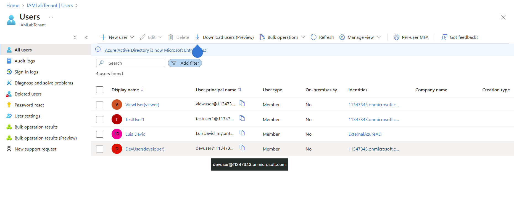

# azure-iam-labs
Hands-on labs in Microsoft Azure Entra ID (IAM, RBAC, users, groups, least privilege
# Lab 1: Tenant-Only IAM Setup

## Objective
Simulate an IAM environment in Azure Entra ID:
- Create users and groups
- Assign directory roles
- Test least-privilege access

---

## Steps I Completed
1. Created a new Entra tenant.  
2. Created `DevUser` and `ViewUser`.  
3. Built a security group (`DevelopersGroup`).  
4. Assigned roles:
   - `User Administrator` → DevUser
   - `Directory Readers` → ViewUser  
5. Logged in with test accounts to validate permissions.

---

## Screenshots
## Step 2: Create Users

### Navigate to Users

### Creating DevUser

### DevUser Created

### Creating ViewUser

### All Users List

---

## Key Takeaways
- Learned user & group management in Entra ID.  
- Practiced RBAC and least-privilege.  
- Documented login tests for role validation.
